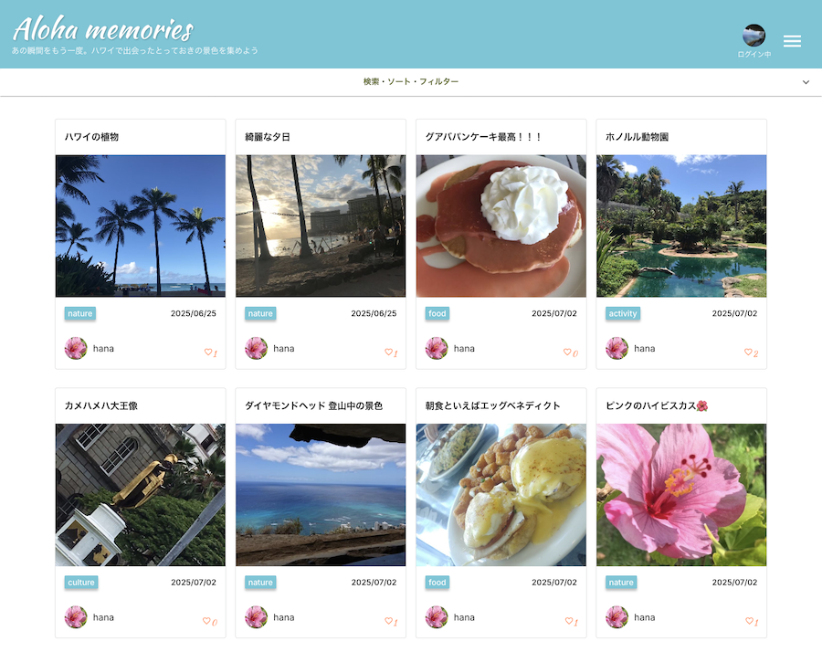
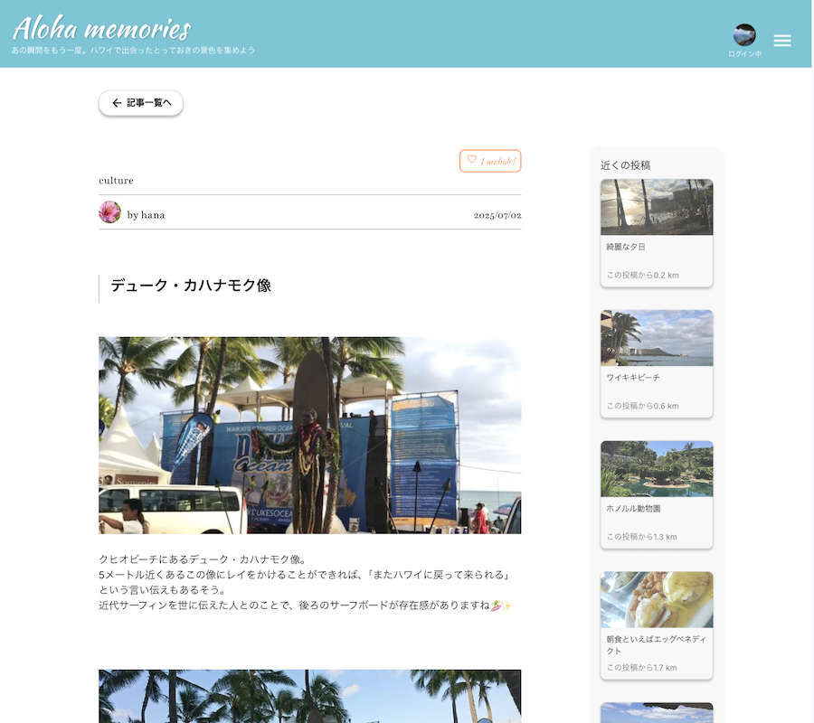

## プロジェクト名

**Hawaii Magazine**

---

## 概要（Overview）

A photo & memory sharing web app for Hawaii lovers.
ハワイ好きのための、雑誌記事風に思い出をシェアできる写真投稿アプリです。

---

## デプロイ済みリンク（Live Demo）

https://hawaii-magazine.vercel.app/

---

## 主な機能（Features）

### ユーザー機能（User）

- ユーザー登録、ログイン、退会（認証）
- マイページ機能（プロフィールの編集）

### 投稿機能（Post）

- 投稿の作成・編集・削除（写真、説明、撮影地情報）
- 投稿の一覧・詳細表示
- ページネーション（投稿の分割表示）

### インタラクション（Interaction）

- いいね機能
- コメント機能
- 投稿・プロフィールの閲覧数ランキング

### マップ・検索機能（Map & Search）

- 撮影地のマップ表示（Google Maps 連携）
- 地図から投稿検索
- フィルター（場所・カテゴリ）・ソート
- 近くの投稿表示

---

## 🛠 技術スタック（Tech Stack）

- **フロントエンド**：React, Next.js, TypeScript

  - 状態管理：useContext, useState
  - フォーム：react-hook-form
  - 外部 API：Google Maps API

- **バックエンド**：Next.js（App Router / Route Handlers を使用して API 実装）

- **認証**：JWT

- **データベース**：Neon + Prisma

- **デプロイ**：Vercel

---

## スクリーンショット（Screenshots）

### 投稿一覧画面

### 投稿表示画面

---

## UI/UX のポイント（Design Highlights）

ハワイ好きの人が旅の思い出を気軽にシェアし合えるよう、視覚的で直感的な UI と、心地よい色使いを心がけました。ユーザーが操作に迷わず、**「思い出＝写真」** に集中できる体験を大切にしています。

- **レスポンシブ対応**.
  PC・スマホ両方に対応し、投稿一覧やマップなどを快適に閲覧可能。

- **世界観を意識した配色とフォント**.
  南国らしい柔らかい色味を基調に、写真が主役として引き立つようデザイン。

- **シンプルなナビゲーション構成と余白を活かしたレイアウト**.
  必要な情報だけを提示し、ユーザーがストレスなく思い出に浸れるように設計。

---

## 今後の予定・課題（Future Plans / TODO）

- 機能追加予定
  - 通知機能（いいね・コメントが届いたとき）
  - 投稿の保存・お気に入り機能
  - 投稿の PDF 出力機能

---

## 作者について（About Me）

ひかる (Hikaru).
Web 開発者を目指して勉強中.
React・Next.js と UI/UX を中心にスキルを伸ばしています。
